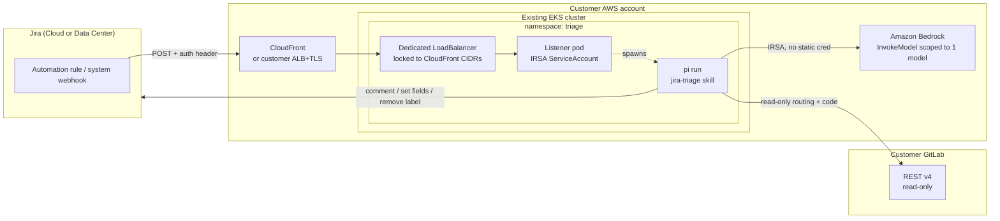
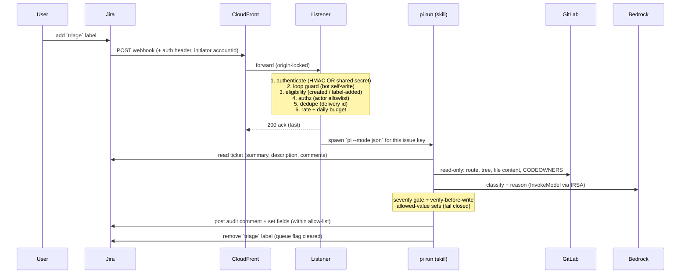

# Architecture

How the triage agent is put together, how a request flows through it, and the
trust model that keeps an LLM-with-tools acting on real tickets safe.

The same **agent** runs in two deployment shapes:

- **Workshop** — a self-contained lab: EKS + self-hosted GitLab + the agent, all
  built by `workshop/terraform` and the `Makefile`.
- **Customer** — the agent only, installed into a cluster the customer already
  runs, against their existing GitLab/Jira. Built by `agent/deploy/terraform` + `agent/deploy/k8s`.

The agent's internals (listener, skill, guardrails) are identical in both; only
what surrounds it differs.

---

## Runtime model: receiver → one-shot run Job

There is **no long-lived stateful listener**. Two roles, both from the same image:

```
  Jira / any source
        │  webhook
        ▼
  ┌─────────────┐   creates a        ┌──────────────────────────┐
  │  RECEIVER   │   one-shot Job ──▶  │  RUN (Kubernetes Job)     │
  │ (stateless, │                     │  node runtime/runner      │
  │  N replicas)│                     │  = agent-def + harness,   │
  │ auth→gate→  │                     │    runs once, exits        │
  │  dispatch   │                     └──────────────────────────┘
  └─────────────┘
```

- The **receiver** holds **no per-event state** — no dedupe cache, no concurrency
  semaphore, no daily counter, and (now) **no Jira `/myself` call**. It authenticates,
  gates, creates a Job, and acks. Being stateless, it scales to N replicas.
- **Kubernetes is the dedupe store + concurrency limiter** (what the old in-memory
  listener did): the Job is named deterministically from the delivery id, so a
  duplicate delivery collides with `409 AlreadyExists`; a namespace `ResourceQuota`
  caps concurrent run pods. (Dev/workshop can use `DISPATCH=exec`, which spawns the
  runner as a subprocess and keeps dedupe+limit in-memory — single-process only.)
- The **runner** is the one-shot program a Job executes: load the agent definition,
  build the harness command, run it once, exit with a code reflecting success.

## Four pluggable axes — the engine is agnostic

You change behavior by configuration, not code. The engine (`runtime/receiver`,
`runtime/runner`, `runtime/lib`) contains **no** Jira/pi/triage specifics — each
lives in its adapter:

```
   TRIGGER          AGENT (the skill)        HARNESS              DISPATCH
   how an event     what the agent IS:       which coding-agent   how a run
   is authed,       prompt + rubric +        CLI runs the prompt  starts
   parsed, gated    tools in SKILL.md
   ───────────      ──────────────────       ──────────────       ──────────
   jira (default)   jira-triage (default)    pi (default)         k8s-job (default)
   generic          <your skill dir>         kiro-cli             exec
   <your adapter>                            opencode
```

- **The skill drives the agent.** `SKILL.md`'s YAML frontmatter (`prompt`,
  `loopMarker`, `authorizedActors`, `trustTools`, `model`) IS the agent
  definition — see [agent-def.js](../../agent/runtime/lib/agent-def.js). Point
  `AGENT_PATH` at a different skill → a different agent, no code change.
- **The trigger feeds it** (`TRIGGER`). `jira` carries all Jira eligibility / loop
  guard / actor-allowlist logic and reads its own bot accountId from
  `JIRA_BOT_ACCOUNT_ID` — the engine makes no Jira API call. `generic` is a
  signed-POST passthrough.
- **The harness runs it** (`HARNESS`).
- **The dispatch starts it** (`DISPATCH`): `k8s-job` (production) or `exec` (dev).

## Components

| Component | Path | Role |
|---|---|---|
| **Receiver** | `agent/runtime/receiver/server.js` | Thin, stateless HTTP front door + startup. Per request: `trigger.authenticate` → parse → `trigger.decide` (gate) → `dispatch` one run → ack. No per-event state. Zero third-party deps. |
| **Runner** | `agent/runtime/runner/main.js` | The one-shot program a run executes (a Job, or an exec subprocess): load agent-def → build harness command → run once → exit with a code reflecting tool success. |
| **Dispatch adapters** | `agent/runtime/dispatch/` | `index.js` registry (`DISPATCH` env, default `k8s-job`); `k8s-job.js` (create a Job per event — K8s provides dedupe via deterministic name + concurrency via ResourceQuota); `exec.js` (subprocess, in-memory dedupe+limit for dev). |
| **Shared lib** | `agent/runtime/lib/` | `agent-def.js` (parse SKILL.md frontmatter + render prompt), `auth.js` (constant-time HMAC + shared-secret), `limits.js` (dedupe + limiter, used only by exec dispatch). Agnostic. |
| **Trigger adapters** | `agent/runtime/trigger/` | `index.js` registry (`TRIGGER` env, default `jira`); `jira.js` (webhook/Automation auth + eligibility + loop guard + authz + `JIRA_BOT_ACCOUNT_ID`); `generic.js` (signed-POST passthrough). Add an event source with one file. |
| **Skill / agent** | `agent/agents/jira-triage/` | The default agent: `SKILL.md` (frontmatter + triage rubric + trust boundary), bundled scripts `jira.sh` / `gitlab.sh`, and its own `Dockerfile`. One dir per agent. |
| **Harness adapters** | `agent/runtime/harness/` | Pluggable coding-agent CLIs (`HARNESS` env; default `pi`; `kiro-cli` + `opencode` built in). Each owns argv + result-reading. Skill-less harnesses share `inline-skill.js`. |
| **Image** | `agent/deploy/docker/` + `agent/agents/<name>/Dockerfile` | Three agent-blank-until-last layers: `base.Dockerfile` (engine only) → `<harness>.Dockerfile` (+ CLI) → the agent's own Dockerfile (+ one agent). Same image is both receiver and runner. `make triage-image AGENT=<name> HARNESS=<name>`. |
| **Manifests** | `agent/deploy/k8s/` | `namespace.yaml` (receiver + runner SAs), `rbac.yaml` (receiver→create Jobs + ResourceQuota), `receiver.yaml` (Deployment + LB), `netpol.yaml` (receiver + run-pod policies), config/secrets. |
| **Cloud deps** | `agent/deploy/terraform/` | Runner IRSA role (model access, scoped to one model) + optional CloudFront for a domain-free HTTPS webhook endpoint. |

---

## Topology — customer install (agent only)



The workshop topology is the same picture with two additions: GitLab runs
**inside** the cluster (Helm), and CloudFront + the cluster are created together
by one `workshop/terraform` apply.

---

## Request flow — label-add to triaged ticket



---

## Trust model

The agent runs an LLM, with a shell tool, over **attacker-controllable input**
(ticket text and repository contents). The defenses, in layers:

| # | Guard | What it stops |
|---|---|---|
| Auth | HMAC (`X-Hub-Signature`) **or** constant-time shared secret (`X-Triage-Token`) | Forged/unauthenticated webhooks. Both compared in constant time. |
| R10b | LoadBalancer locked to CloudFront origin CIDRs | Direct POSTs to the public LB, bypassing the front door. |
| R7 | Loop guard — bot `accountId` + stateless disclaimer marker | The agent triggering itself in an infinite loop on its own comment. |
| R6b | Actor allowlist (`AUTHORIZED_ACTORS`) on label-add | Anyone who can edit labels spending Bedrock tokens. |
| R8 | Dedupe (≥24h TTL) on delivery id | Replays and Jira retries double-triaging. |
| R10c | Concurrency semaphore + rate ceiling + **daily budget** | A label storm or loop running up unbounded model spend. |
| R2 | Allowed-value sets (labels/priorities/issue-types/assignees), **fail closed** | The agent writing arbitrary or invented field values. |
| R2c | Severity gate — `high` ⇒ `needs-human`, no field writes | Autonomous action on the riskiest tickets. |
| R2d | Verify-before-write (assignee tied to CODEOWNERS, priority to rubric) | Acting on the reporter's say-so or a prompt injection. |
| R2a | Skill rubric: repo code informs reasoning, **never** pasted into a comment | Source/secret leakage into a Jira comment. |
| R12 | Egress NetworkPolicy + IRSA scoped to one model | Exfiltration of the IRSA token or repo contents to an arbitrary host. |
| — | GitLab token is **read-only**, minimum privilege | The agent modifying source. |

> **Why two auth paths?** Jira Cloud **Automation rules** can't compute an HMAC
> over the request body, so they authenticate with the shared-secret header.
> Jira **Data Center / Server** system webhooks sign with HMAC. The listener
> accepts either, so the same image works for both — see
> [Configure Jira](../customer-install/03-configure-jira.md).

## Design decisions worth knowing

- **Pluggable harness, fixed skill.** The triage *rubric* and the
  `jira.sh`/`gitlab.sh` *scripts* are harness-neutral, so swapping the coding
  agent (pi ↔ kiro-cli ↔ your own) changes only *invocation* and *result-reading*
  — encapsulated in a ~40-line adapter. Streaming harnesses parse events
  (`interpret`); non-streaming ones classify from the exit code (`finalize`).
  Harnesses without a skill-loader (kiro-cli) get the rubric inlined into the
  prompt. This is what makes it plug-and-play for customers.
- **Stateless receiver, K8s as the state store.** The receiver holds no dedupe
  cache or limiter, so it scales to N replicas freely. Dedupe (deterministic Job
  name → 409) and concurrency (ResourceQuota) live in Kubernetes. The `exec`
  dispatcher keeps them in-memory and is therefore single-process — for dev only.
- **Ack fast, work async.** The receiver returns `200` after creating the Job
  (not after the run finishes), so the webhook never times out on a model run.
  Each run is its own pod — OOM-bounded, retried via `backoffLimit`, auto-cleaned
  via `ttlSecondsAfterFinished`.
- **No domain required.** CloudFront's default `*.cloudfront.net` cert gives a
  valid-TLS public endpoint with no domain purchase; TLS terminates at CloudFront
  and the origin hop is plain HTTP inside the VPC. Customers who already have a
  domain + ALB can skip CloudFront entirely.
