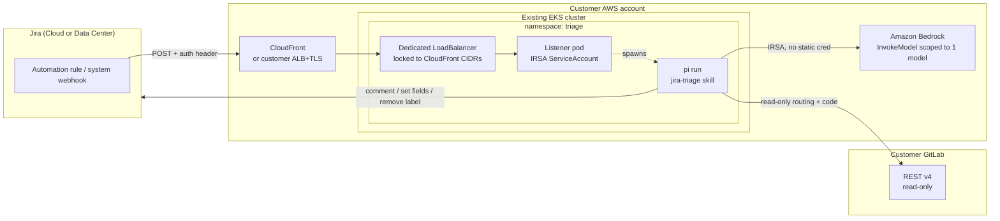
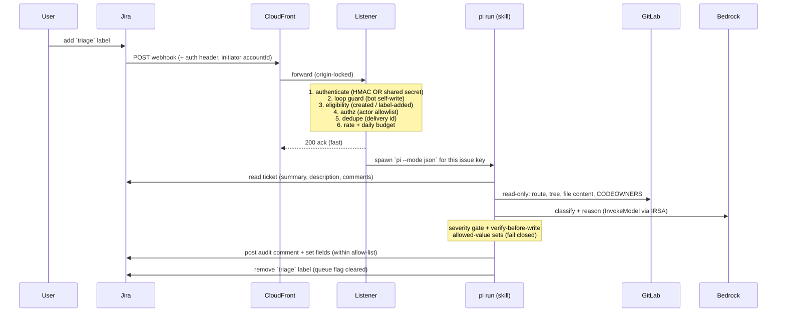

# Architecture

How the triage agent is put together, how a request flows through it, and the
trust model that keeps an LLM-with-tools acting on real tickets safe.

The same **agent** runs in two deployment shapes:

- **Workshop** — a self-contained lab: EKS + self-hosted GitLab + the agent, all
  built by `workshop/terraform` and the `Makefile`.
- **Customer** — the agent only, installed into a cluster the customer already
  runs, against their existing GitLab/Jira. Built by `agent/terraform` + `agent/k8s`.

The agent's internals (listener, skill, guardrails) are identical in both; only
what surrounds it differs.

---

## Components

| Component | Path | Role |
|---|---|---|
| **Listener** | `agent/listener/` | Node HTTP server. Authenticates the inbound webhook, applies the gate (loop guard → eligibility → authz → dedupe → rate/budget), acks fast, and spawns one `pi` run per accepted event. Zero third-party deps. |
| **Skill** | `agent/skills/jira-triage/` | The agent's brain: `SKILL.md` (the triage rubric + trust boundary) and bundled scripts `jira.sh` (allow-listed Jira writes) and `gitlab.sh` (bounded read-only source access). |
| **Image** | `agent/docker/triage/Dockerfile` | `tini` → Node listener; bundles the `pi` CLI and the skill. The listener spawns `pi --mode json` per webhook. |
| **Manifests** | `agent/k8s/` | Namespace + IRSA ServiceAccount, listener Deployment + dedicated LoadBalancer, NetworkPolicy (ingress + egress allowlist), and the ConfigMap/Secret. |
| **Cloud deps** | `agent/terraform/` | Bedrock IRSA role (scoped to one model) and an optional CloudFront distribution for a domain-free HTTPS webhook endpoint. |

---

## Topology — customer install (agent only)

The workshop topology is the same picture with two additions: GitLab runs
**inside** the cluster (Helm), and CloudFront + the cluster are created together
by one `workshop/terraform` apply.

---

## Request flow — label-add to triaged ticket

---

## Trust model

The agent runs an LLM, with a shell tool, over **attacker-controllable input**
(ticket text and repository contents). The defenses, in layers:

| # | Guard | What it stops |
|---|---|---|
| Auth | HMAC (`X-Hub-Signature`) **or** constant-time shared secret (`X-Triage-Token`) | Forged/unauthenticated webhooks. Both compared in constant time. |
| R10b | LoadBalancer locked to CloudFront origin CIDRs | Direct POSTs to the public LB, bypassing the front door. |
| R7 | Loop guard — bot `accountId` + stateless disclaimer marker | The agent triggering itself in an infinite loop on its own comment. |
| R6b | Actor allowlist (`AUTHORIZED_ACTORS`) on label-add | Anyone who can edit labels spending Bedrock tokens. |
| R8 | Dedupe (≥24h TTL) on delivery id | Replays and Jira retries double-triaging. |
| R10c | Concurrency semaphore + rate ceiling + **daily budget** | A label storm or loop running up unbounded model spend. |
| R2 | Allowed-value sets (labels/priorities/issue-types/assignees), **fail closed** | The agent writing arbitrary or invented field values. |
| R2c | Severity gate — `high` ⇒ `needs-human`, no field writes | Autonomous action on the riskiest tickets. |
| R2d | Verify-before-write (assignee tied to CODEOWNERS, priority to rubric) | Acting on the reporter's say-so or a prompt injection. |
| R2a | Skill rubric: repo code informs reasoning, **never** pasted into a comment | Source/secret leakage into a Jira comment. |
| R12 | Egress NetworkPolicy + IRSA scoped to one model | Exfiltration of the IRSA token or repo contents to an arbitrary host. |
| — | GitLab token is **read-only**, minimum privilege | The agent modifying source. |

> **Why two auth paths?** Jira Cloud **Automation rules** can't compute an HMAC
> over the request body, so they authenticate with the shared-secret header.
> Jira **Data Center / Server** system webhooks sign with HMAC. The listener
> accepts either, so the same image works for both — see
> [Configure Jira](../customer-install/03-configure-jira.md).

## Design decisions worth knowing

- **Single replica, in-memory state.** Dedupe and the spend limiter are per-pod
  and in-memory, so the Deployment is pinned to `replicas: 1` with a `Recreate`
  strategy (two pods would each dedupe/limit independently). Scaling out requires
  moving that state to a shared store first.
- **Ack fast, work async.** The listener returns `200` before spawning `pi`, so
  Jira's webhook never times out waiting on a model run.
- **No domain required.** CloudFront's default `*.cloudfront.net` cert gives a
  valid-TLS public endpoint with no domain purchase; TLS terminates at CloudFront
  and the origin hop is plain HTTP inside the VPC. Customers who already have a
  domain + ALB can skip CloudFront entirely.
