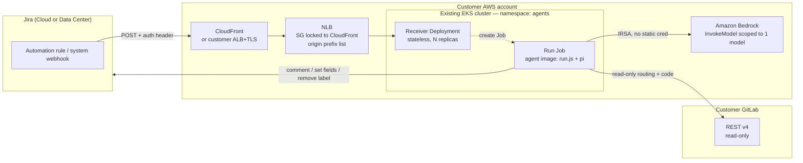

# Architecture

How the triage agent is put together, how a request flows through it, and the
trust model that keeps an LLM-with-tools acting on real tickets safe.

The same **agent** runs in two deployment shapes:

- **Workshop** — a self-contained lab: EKS + self-hosted GitLab + the agent, all
  built by `workshop/terraform` and the `Makefile`.
- **Customer** — the agent only, installed into a cluster the customer already
  runs, against their existing GitLab/Jira. Built by `agent/deploy/terraform` + `agent/deploy/k8s`.

The agent's internals (receiver, skill, guardrails) are identical in both; only
what surrounds it differs.

## Runtime model: receiver → one Job per event

There is **no long-lived stateful runner**. Two pieces:

- **Receiver** — a thin, stateless HTTP Deployment (N replicas). It authenticates
  + gates an event, then creates **one Kubernetes Job** to run it, and acks. It
  holds no per-event state, so it scales horizontally and a restart loses nothing.
- **Run Job** — one Kubernetes Job per accepted event. It runs the agent image's
  `run.js` once (render prompt → spawn the harness → exit), then is cleaned up.

**Kubernetes provides what used to be in-process state:**

| Concern | Old (in-memory listener) | Now (run-as-Job) |
|---|---|---|
| Dedupe | `DedupeCache` (24h TTL), pinned `replicas:1` | Deterministic **Job name** from the delivery id → `409 AlreadyExists` = duplicate |
| Concurrency limit | `SpawnLimiter` semaphore | **`ResourceQuota`** on the namespace |
| Per-run timeout | watchdog `setTimeout` + SIGKILL | Job **`activeDeadlineSeconds`** |
| Retry | (none) | Job **`backoffLimit`** |
| Run isolation | child process in the listener pod | its **own pod** (OOM-bounded, can't wedge siblings) |
| Cleanup | process exit | **`ttlSecondsAfterFinished`** |

This deletes the dedupe cache, the spawn limiter, the watchdog, and the
single-replica constraint from the codebase — K8s does all of it.

---

## The engine is generic: trigger × agent × harness

The engine is **not** triage-specific. Three independently-pluggable pieces, so
you change behavior by configuration, not code:

```
   TRIGGER                 AGENT (the skill)              HARNESS
   how an event is         what the agent IS:             which coding-agent
   authenticated,          its prompt + rubric +          CLI actually runs
   parsed into vars,       tools, declared in             the prompt
   and gated               SKILL.md frontmatter
   ───────────             ──────────────────             ──────────────
   jira (default)          jira-triage (default)          pi (default)
   generic                 <your skill dir>               kiro-cli
   <your adapter>                                         opencode
                                                          <your adapter>
```

- **The skill drives the agent.** `SKILL.md`'s YAML frontmatter (`prompt`,
  `loopMarker`, `authorizedActors`, `trustTools`, `model`) IS the agent
  definition — see [agent-def.js](../../agent/runtime/lib/agent-def.js). Point
  `AGENT_PATH` at a different agent → a different agent, no code change. The
  prompt is a template; `{{vars}}` are filled from the trigger.
- **The trigger feeds it.** `TRIGGER` selects how the webhook is authenticated,
  parsed into prompt vars, and gated. `jira` carries the Jira eligibility / loop
  guard / actor-allowlist logic; `generic` is a signed-POST passthrough for
  non-Jira sources.
- **The harness runs it.** `HARNESS` selects the coding-agent CLI.

## Components

| Component | Path | Role |
|---|---|---|
| **Receiver** | `agent/runtime/receiver.js` | Thin, stateless HTTP front (N replicas). Per request: `trigger.authenticate` → parse → `trigger.decide` (gate) → create one Job (dedupe = Job name) → ack. The only privilege it needs is "create Jobs" (RBAC). |
| **Run** | `agent/runtime/run.js` | The one-shot Job entrypoint: load the agent def → render the prompt from `RUN_VARS` → spawn the harness → exit with its code. No webhook/auth/dedupe/limiter/watchdog (K8s owns those). |
| **Job builder** | `agent/runtime/lib/job.js` | Pure: deterministic `jobName(id)` + a `batch/v1` Job manifest (RUN_VARS, `activeDeadlineSeconds`, `backoffLimit`, `ttlSecondsAfterFinished`, secret via `envFrom`). |
| **K8s client** | `agent/runtime/lib/k8s.js` | Minimal zero-dep in-cluster client — just `createJob` (409 → `{duplicate}`). |
| **Auth** | `agent/runtime/lib/auth.js` | Constant-time HMAC + shared-secret verification (trigger-agnostic). |
| **Agent definition** | `agent/runtime/lib/agent-def.js` + a skill's `SKILL.md` frontmatter | Parses the frontmatter into `{ prompt, loopMarker, authorizedActors, trustTools, model, body }` and renders the prompt template. The skill, not the code, defines the agent. |
| **Trigger adapters** | `agent/runtime/trigger/` | `index.js` registry (`TRIGGER` env, default `jira`); `jira.js` (auth + eligibility + stateless loop guard + authz); `generic.js` (signed-POST passthrough). Add an event source with one file. |
| **Skill / agent** | `agent/agents/jira-triage/` | The default agent: `SKILL.md` (frontmatter + triage rubric + trust boundary), bundled scripts `jira.sh` / `gitlab.sh`, and its own `Dockerfile`. One dir per agent. |
| **Harness adapters** | `agent/runtime/harness/` | Pluggable coding-agent CLIs (`HARNESS` env; default `pi`; `kiro-cli` + `opencode` built in). Each owns argv + result-reading. Skill-less harnesses share `inline-skill.js` — see the [harness README](../../agent/runtime/harness/README.md). |
| **Image** | `agent/deploy/docker/` + `agent/agents/<name>/Dockerfile` | Three agent-blank-until-last layers: `base.Dockerfile` (engine: receiver + run + adapters) → `<harness>.Dockerfile` (+ CLI) → the agent's own Dockerfile (+ one agent). One image, two entrypoints. `make agent-image AGENT=<name> HARNESS=<name>`. |
| **Manifests** | `agent/deploy/k8s/` | `namespace` (2 SAs) + `rbac` (receiver→create Jobs) + `resourcequota` (concurrency) + `netpol` (run-pod egress) + `receiver` (Deployment + Service) + config/secret. |
| **Cloud deps** | `agent/deploy/terraform/` | Bedrock IRSA role (scoped to one model) + optional CloudFront for a domain-free HTTPS webhook endpoint. |

---

## Topology — customer install (agent only)



The workshop topology is the same picture with two additions: GitLab runs
**inside** the cluster (Helm), and CloudFront + the cluster are created together
by one `workshop/terraform` apply.

---

## Request flow — label-add to triaged ticket

```mermaid
sequenceDiagram
  participant U as User
  participant J as Jira
  participant CF as CloudFront
  participant RC as Receiver
  participant K as K8s API
  participant P as Run Job (run.js + harness)
  participant G as GitLab
  participant B as Bedrock

  U->>J: add `triage` label
  J->>CF: POST webhook (+ auth header, initiator accountId)
  CF->>RC: forward
  Note over RC: 1. authenticate (HMAC OR shared secret)<br/>2. loop guard (stateless marker)<br/>3. eligibility (created / label-added)<br/>4. authz (actor allowlist)
  RC->>K: create Job run-<hash(delivery-id)>
  Note over K: 409 AlreadyExists = duplicate → ack<br/>ResourceQuota caps concurrency
  RC-->>CF: 200 ack (fast)
  K->>P: schedule one pod (its own SA / IRSA)
  P->>J: read ticket (summary, description, comments)
  P->>G: read-only: route, tree, file content, CODEOWNERS
  P->>B: classify + reason (InvokeModel via IRSA)
  Note over P: severity gate + verify-before-write<br/>allowed-value sets (fail closed)
  P->>J: post audit comment + set fields (within allow-list)
  P->>J: remove `triage` label (queue flag cleared)
  Note over P: pod exits; ttlSecondsAfterFinished cleans up
```

---

## Trust model

The agent runs an LLM, with a shell tool, over **attacker-controllable input**
(ticket text and repository contents). The defenses, in layers:

| # | Guard | What it stops | Where |
|---|---|---|---|
| Auth | HMAC (`X-Hub-Signature`) **or** constant-time shared secret (`X-Triage-Token`) | Forged/unauthenticated webhooks. | receiver |
| R10b | Origin lock — NLB SG allows inbound only from CloudFront's managed prefix list (one rule) | Reaching the receiver directly, bypassing CloudFront/auth. | LB SG |
| R7 | Loop guard — **stateless** disclaimer/loop marker (no bot-account lookup) | The agent triggering itself on its own comment. | trigger |
| R6b | Actor allowlist (`AUTHORIZED_ACTORS`) on label-add | Anyone who can edit labels spawning runs. | trigger |
| R8 | Dedupe = deterministic **Job name** (409 = duplicate) | Replays and retries double-triaging. | K8s |
| R10c | **`ResourceQuota`** caps concurrent run pods | A label storm running up unbounded concurrent spend. | K8s |
| — | Per-run **`activeDeadlineSeconds`** + `backoffLimit` | A hung/looping run holding resources forever. | K8s |
| R2 | Allowed-value sets (labels/priorities/issue-types/assignees), **fail closed** | The agent writing arbitrary or invented field values. | skill |
| R2c | Severity gate — `high` ⇒ `needs-human`, no field writes | Autonomous action on the riskiest tickets. | skill |
| R2d | Verify-before-write (assignee tied to CODEOWNERS, priority to rubric) | Acting on the reporter's say-so or a prompt injection. | skill |
| R2a | Repo code informs reasoning, **never** pasted into a comment | Source/secret leakage into a Jira comment. | skill |
| R12 | Egress NetworkPolicy on run pods + IRSA scoped to one model | Exfiltration of the IRSA token or repo contents. | K8s + IAM |
| — | GitLab token **read-only**; receiver RBAC = create Jobs only | The agent modifying source; the receiver doing anything but enqueue. | IAM + RBAC |

> **Why two auth paths?** Jira Cloud **Automation rules** can't compute an HMAC
> over the request body, so they authenticate with the shared-secret header.
> Jira **Data Center / Server** system webhooks sign with HMAC. The receiver
> accepts either — see [Configure Jira](../customer-install/03-configure-jira.md).

> **Daily spend cap.** The old in-process rolling-24h budget is gone (it needed
> shared state). `ResourceQuota` bounds *concurrency*; the cumulative dollar
> backstop is provider-side (**AWS Budgets / Bedrock quotas**). See
> [Security](../customer-install/06-security.md).

## Design decisions worth knowing

- **No long-lived stateful runner.** Dedupe, concurrency, timeout, retry, and
  cleanup are all delegated to Kubernetes (Job name, ResourceQuota,
  `activeDeadlineSeconds`, `backoffLimit`, `ttlSecondsAfterFinished`). That
  deleted the dedupe cache, spawn limiter, watchdog, and single-replica pin from
  the code — the receiver is now stateless and the run is a dumb one-shot.
- **One image, two entrypoints.** The agent image carries both `receiver.js`
  (the Deployment) and `run.js` (each Job). The receiver gates against the *same*
  baked `SKILL.md` the run uses, so gate and run can't drift.
- **Pluggable harness, fixed skill.** Swapping the coding agent
  (pi ↔ kiro-cli ↔ opencode ↔ your own) changes only a small adapter; the rubric
  and `jira.sh`/`gitlab.sh` scripts are harness-neutral.
- **Stateless loop guard.** The guard relies only on the agent's own loop marker
  in the triggering comment — no `/myself` call, no per-instance state, so the
  receiver needs no Jira credentials at all.
- **No domain required.** CloudFront's default `*.cloudfront.net` cert fronts the
  receiver Service with valid TLS and no domain purchase; customers with their
  own domain + ALB can skip it.
- **NLB + prefix-list origin lock.** The receiver sits behind an LBC-managed NLB
  so its security group can reference CloudFront's origin-facing managed prefix
  list as a *single* rule. A classic ELB would fan ~45 CloudFront CIDRs into ~45
  SG rules and hit the 60-rules-per-SG limit (`RulesPerSecurityGroupLimitExceeded`
  → the LB never provisions). This is why the cluster needs the AWS Load Balancer
  Controller for the default ingress path.
