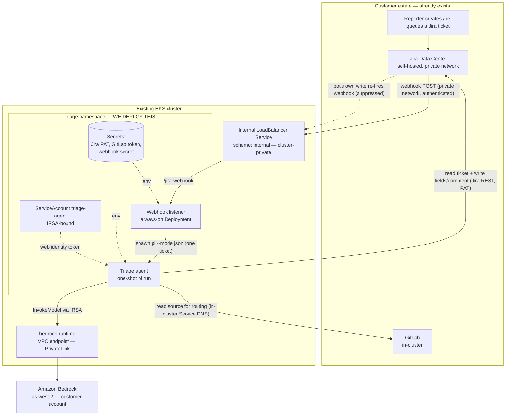
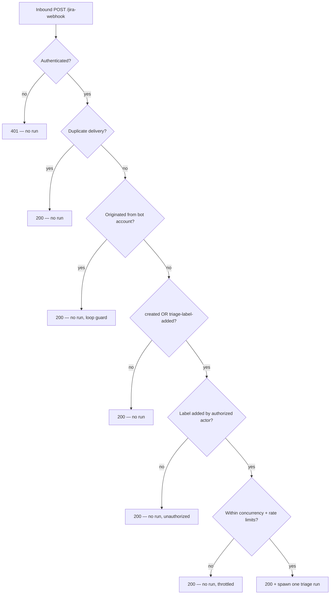

# High-Level Design — Jira Triage Agent

## 1. Overview

This document describes an autonomous **Jira triage agent** to be deployed into
the customer's **existing** Amazon EKS cluster. On a new or re-queued Jira
ticket, the agent classifies it (category, state, severity), and — for
low/medium-severity tickets — sets a bounded set of fields and posts an audit
comment. High-severity tickets receive a `needs-human` label and a written
recommendation only; the agent never auto-writes the riskiest tickets.

It is the first agent on the platform and intentionally narrow: **PM-grade
triage, not code root-causing or auto-fix.**

### What we deploy vs. what already exists

This is the critical scoping statement for every reviewing team:

| Already in the customer estate (we do NOT touch) | We deploy (new) |
|---|---|
| The EKS cluster + node group | A new `triage` Kubernetes namespace |
| GitLab (in-cluster) | The webhook **listener** Deployment |
| Jira Data Center (self-hosted, private network) | A one-shot **triage agent** (pi.dev) it spawns |
| The cluster VPC, subnets, NAT | An **internal** LoadBalancer Service (cluster-private) |
| The cluster OIDC provider | An IRSA IAM role scoped to one Bedrock model |
| | A `bedrock-runtime` VPC endpoint (PrivateLink) |
| | Kubernetes Secrets (Jira PAT, GitLab token, webhook secret) |
| | A NetworkPolicy isolating the listener |

We provision **no** cluster, no GitLab, no Jira, no public DNS, and no
internet-facing infrastructure.

> **Note on the repository.** The accompanying workshop repo was first built
> against Jira **Cloud** to prove the design in a customer-like sandbox. The
> customer target is Jira **Data Center (self-hosted)** on a private network.
> This HLD documents the **Data Center** target architecture. Section 9
> enumerates the concrete code deltas required to move the implementation from
> the Cloud sandbox to the Data Center target.

---

## 2. Architecture and data flow

The dashed Jira→listener edge is the **feedback loop** the listener suppresses:
the agent's own writes re-fire the webhook, but the listener drops events
originating from the bot account.

### Request lifecycle

1. A reporter creates a ticket, or adds the `triage` label to re-queue one.
2. Jira DC POSTs a webhook to the **internal** LoadBalancer over the private
   network. There is **no public endpoint**.
3. The **listener** authenticates the request, applies its gating logic
   (below), acknowledges with `200` within Jira's retry window, then spawns the
   triage run **off the request path**.
4. The **triage agent** (a one-shot pi process) reads the ticket via the Jira
   REST API, optionally reads GitLab for routing, calls Bedrock for
   classification, then writes its result back to the ticket.
5. The agent removes the `triage` label as its last act; the process exits. No
   state persists between runs.

### Listener gating logic (decision order)

Each gate is a fail-closed drop, not an error: ineligible traffic never mutates
a ticket and never spawns a billable model run.

---

## 3. Trust boundaries and network paths

The deployed design has **no internet-facing component**. Every path is either
inside the cluster, inside the VPC, or across the customer's private network.

| # | Path | Protocol | Boundary crossed | Control |
|---|---|---|---|---|
| 1 | Jira DC → internal LoadBalancer | HTTP(S), private | Customer net → cluster VPC | Internal LB scheme; SG restricted to Jira's source range; webhook authenticated |
| 2 | LoadBalancer → listener pod | HTTP | VPC → pod | NetworkPolicy: only the LB hop may reach the listener port |
| 3 | Listener → triage agent | in-process spawn | none (same pod) | One-shot subprocess; bounded by concurrency + rate limits |
| 4 | Agent → Jira DC REST | HTTPS | Pod → customer net | Bearer PAT (bot account), bounded write surface (§4) |
| 5 | Agent → GitLab | HTTP, in-cluster Service DNS | Pod → pod | Read-only deploy token (`read_repository`); structured output only |
| 6 | Agent → Bedrock | HTTPS via PrivateLink | Pod → VPC endpoint → Bedrock | IRSA (no static key); IAM policy `aws:SourceVpce`-locked |

**No path 0.** There is deliberately no public ingress, no CloudFront, no
public LoadBalancer, and no custom public DNS. (The Cloud sandbox needed those
because Jira Cloud calls in from the internet; the Data Center target does not.)

### In-cluster isolation

- The listener sits in its own `triage` namespace.
- A **NetworkPolicy** denies pod-to-pod ingress to the listener, so a
  compromised workload elsewhere in the cluster (including a GitLab pod) cannot
  POST to the listener and bypass the webhook authentication. Only the
  LoadBalancer hop (the VPC/node range) may reach the listener port.
  - *Enforcement caveat:* with the AWS VPC CNI, NetworkPolicy is only enforced
    when the CNI's network-policy controller is enabled. If the customer's
    cluster does not enable it, the LoadBalancer security group is the sole
    network control on path 2. To confirm with the platform team.

---

## 4. Permissions inventory

This is the complete set of privileges the agent holds. Each is least-privilege
and independently revocable.

### 4.1 AWS / Bedrock (IRSA — no static credential)

The agent's pod ServiceAccount is bound, via the cluster's OIDC provider, to an
IAM role. EKS injects a short-lived web-identity token; there is **no static
model key** to store or rotate.

- **Actions:** `bedrock:InvokeModel`, `bedrock:InvokeModelWithResponseStream` —
  nothing else.
- **Resource scope:** exactly one model. The policy names the specific
  foundation-model ARN and the region-qualified inference-profile ARN — never
  `*`. A stolen token cannot invoke arbitrary (expensive) models.
- **Network condition:** when the `bedrock-runtime` VPC endpoint is in place,
  the policy is conditioned on `aws:SourceVpce`, so an exfiltrated IRSA token
  **cannot be used from outside the VPC**.
- **Trust:** the role trusts only the `triage:triage-agent` ServiceAccount via
  the cluster OIDC provider.

### 4.2 Jira Data Center

- **Identity:** a dedicated **triage bot account** (not a human's). Its identity
  is what the loop guard keys on.
- **Auth:** a **Personal Access Token (Bearer)** for that bot account, stored as
  a Kubernetes Secret.
- **Write surface — bounded, not free-form.** The agent may write only:
  - `priority` — from a configured allowed list
  - `labels` — from a configured allowed list (additive)
  - `assignee` — from a configured on-call account pool only (no black-hole
    destinations)
  - `issue type` — from a configured allowed list (and called out explicitly in
    the audit comment)
  - one **comment** per run, prefixed with an AI-disclaimer line.

  Any value outside the configured set is **rejected before the API call** — the
  agent fails closed. The bot account's Jira project permissions should be
  scoped to the triage project(s) only.

### 4.3 GitLab

- **Auth:** a **minimum-privilege project deploy token** with `read_repository`
  (add `read_api` only if routing lookups require it). **Not** a personal access
  token.
- **Use:** read-only routing lookups. The integration returns only a bounded,
  structured object (`{component, owner}`) — raw repository file content never
  enters the agent's context or any Jira comment.

### 4.4 Kubernetes

- One ServiceAccount (`triage-agent`), IRSA-annotated. No cluster-admin, no
  broad RBAC. The listener runs non-root with a read-only allowed-value config
  mounted from a ConfigMap.

---

## 5. Secrets and rotation

Three long-lived application secrets, all stored as Kubernetes Secrets in the
`triage` namespace (the Bedrock credential is **not** among them — it is IRSA):

| Secret | Purpose | Min privilege |
|---|---|---|
| Jira bot PAT | Read/write the triage project as the bot | Triage project(s) only |
| GitLab read token | Routing lookups | `read_repository` deploy token |
| Webhook secret | Authenticate inbound webhooks | ≥32 bytes from a CSPRNG |

**Rotation procedure (≤90 days):** revoke the old credential → generate the new
one → update the Secret → roll the listener Deployment. The webhook secret is
rotated in lockstep with the Jira-side webhook configuration. If any token ever
appears in logs, treat it as compromised and rotate immediately.

**Log hygiene:** the listener emits structured, non-sensitive events only — no
ticket bodies, no PII, no payloads, no model tool output. Review before
forwarding stdout to any shared log sink.

---

## 6. Threat model and blast-radius controls

The central security bet: **the agent reads attacker-controllable input (ticket
text, repo content) and then writes with real privilege.** The controls below
bound the worst case rather than assuming the input is benign.

| Threat | Control |
|---|---|
| Unauthenticated/forged webhook | Webhook authenticated (shared secret); internal-only network path; LB SG restricted to Jira's source |
| Anyone-who-can-label spends model budget | Label-add triggers a run only from an **allowlisted actor**; unauthorized adds are dropped |
| Feedback loop (agent's write re-triggers) | Loop guard drops events from the bot account; stateless self-write marker covers the cold-start window |
| Duplicate / replayed deliveries | Idempotent dedupe on the delivery identifier; convergent writes (replays are no-ops) |
| Prompt injection in ticket/repo text | Rubric treats all ticket/repo text as untrusted **data**, never instructions; classification follows the rubric only |
| Injection forces an in-set-but-wrong write | **Severity gate:** high-severity tickets get *no* field writes — only `needs-human` + a recommendation. **Verify-before-write:** any write whose justification fails a deterministic check is downgraded to a recommendation |
| Repo content exfiltrated into a comment | GitLab integration returns only `{component, owner}`; raw file content is structurally discarded before reaching the agent |
| Stolen IRSA token used externally | IAM policy `aws:SourceVpce`-locked to the VPC endpoint; scoped to one model |
| Cost blowout / label-storm | Concurrency semaphore + global spawn-rate ceiling; each drop is a logged `200` |
| Compromised in-cluster pod POSTs the listener | NetworkPolicy denies pod-to-pod ingress to the listener |

**Human override is always preserved:** every action is recorded in the audit
comment, and high-severity tickets are never written autonomously.

---

## 7. Deployment and rollback

**Deployment** is additive and self-contained in the `triage` namespace:

1. Provision the IRSA role + `bedrock-runtime` VPC endpoint (Terraform, in the
   customer account).
2. Create the `triage` namespace, IRSA-annotated ServiceAccount, NetworkPolicy.
3. Create the three Secrets and the allowed-value ConfigMap.
4. Deploy the listener + internal LoadBalancer Service.
5. Configure the Jira-side webhook (customer Jira admins) pointing at the
   internal LB, with the shared secret.

**Rollback** is deleting the `triage` namespace and the internal LB Service
(releasing the ELB/ENI), then the Terraform additions. Nothing in the customer's
existing GitLab, Jira, or cluster configuration is modified, so removal leaves
no residue beyond the dedicated bot account and tokens (which the customer
revokes).

**Blast radius of the whole system if disabled:** triage stops; tickets are
handled manually as they are today. No existing workflow depends on it.

---

## 8. Integration assumptions (to confirm with the customer)

These are the points the design assumes but cannot verify from our side; each
is owned by a customer team.

- **Jira DC reachability.** The webhook can reach an internal LoadBalancer in
  the cluster VPC (private routing exists: peering / TGW / VPN / Direct
  Connect). *(Networking)*
- **Webhook trigger configuration.** The Jira-side trigger (native webhook or
  Automation for Jira rule) is configured by Jira admins, including how the
  shared secret is attached. The listener authenticates the webhook; the exact
  Jira-side mechanism is the customer's to set. *(Jira admins)*
- **Bot account + PAT** with comment/edit permission scoped to the triage
  project(s). *(Jira admins)*
- **GitLab deploy token** (`read_repository`) for the routed project(s).
  *(GitLab admins)*
- **Bedrock model access** enabled in `us-west-2` for the account, and the
  VPC-CNI network-policy controller enabled if the NetworkPolicy layer is to be
  load-bearing. *(Platform / AWS)*
- **Allowed value sets** (priority names, issue types, label set, on-call
  assignee account ids) confirmed against the live project; the agent fails
  closed until provided. *(Jira admins)*

---

## 9. Jira Cloud → Data Center integration deltas (engineering)

The implementation in the workshop repo currently targets Jira **Cloud**. The
following concrete changes move it to the Jira **Data Center** target. These are
the engineering work items behind the architecture above; none change the data
flows, trust boundaries, or permissions model in §2–§6.

| Concern | Current (Cloud) | Data Center target | Where |
|---|---|---|---|
| **Auth scheme** | Basic `base64(email:token)` | **Bearer PAT** (`Authorization: Bearer <token>`); no account email | `skills/jira-triage/scripts/jira.sh`; `JIRA_EMAIL` secret drops out |
| **REST API version** | `/rest/api/3` | **`/rest/api/2`** (DC has no v3) | `jira.sh` `_api()` base path |
| **Comment body** | ADF (`{type:"doc",...}`) | **Wiki markup / plain text** body | `jira.sh cmd_comment` |
| **Identity probe** | `GET /rest/api/3/myself` → `accountId` | `GET /rest/api/2/myself` → **`name`/`key`** (no `accountId`) | listener `resolveBotAccountId()` |
| **Loop guard key** | `payload.user.accountId` | **`payload.user.name`** (or `key`) | listener `gate.js` `decide()` |
| **Authorized actors** | Cloud `accountId`s | DC user **`name`/`key`s** | `AUTHORIZED_ACTORS` env |
| **Allowed assignees** | `accountId`s | DC user **`name`/`key`s** | `triage-config` ConfigMap |
| **Webhook trigger** | Cloud **system webhook** (sends `X-Hub-Signature` HMAC + `X-Atlassian-Webhook-Identifier`) | **DC native webhook or Automation rule** — native webhooks send neither header; the authentication mechanism and an idempotency key must be supplied a DC-supported way | listener `gate.js` (signature + dedupe), Jira-side config |
| **Dedupe key** | `X-Atlassian-Webhook-Identifier` | A DC-available idempotency value (e.g. derived from issue key + changelog id, or an Automation-supplied header) | listener `limits.js` `DedupeCache` |
| **Ingress** | CloudFront → public LB, SG locked to CloudFront prefix list | **Internal LoadBalancer** (`scheme: internal`), SG restricted to Jira's source range; CloudFront + public LB **removed** | `k8s/triage-listener.yaml` Service; `terraform/cloudfront.tf` dropped |

> **Webhook authentication on DC is the one open mechanism.** The listener's
> authentication step is retained as a principle (every inbound webhook is
> authenticated before it can spawn a run); the precise DC mechanism — a native
> webhook with a secret path/token, an Automation-for-Jira rule that attaches a
> signed header, or mutual TLS — is selected with the customer's Jira admins
> during rollout. The internal-only network path and source-range restriction
> are the baseline controls regardless of which is chosen.

---

## 10. Out of scope (v1)

- Deep code root-cause analysis with file/function pointers.
- Drafting fixes or opening GitLab merge requests.
- Bulk triage of the existing backlog (triage is event-driven).
- Provisioning or modifying the cluster, GitLab, or Jira.
